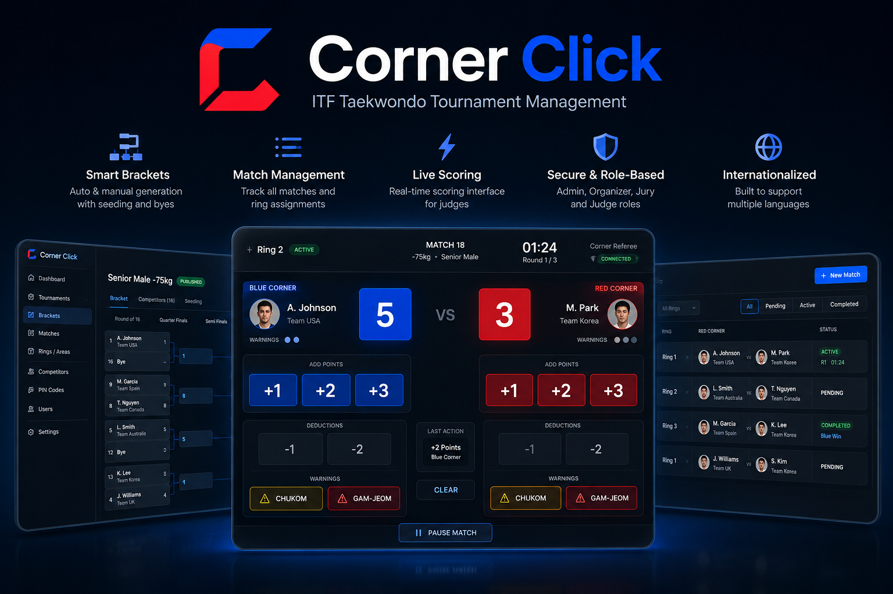

<div align="center">
  
</div>

# Corner Click

Corner Click is a comprehensive web application designed for managing ITF Taekwondo tournaments. It empowers organizers to seamlessly create tournament brackets, list upcoming matches, and provides a highly responsive, real-time scoring interface for judges.

## Core Features

- **Bracket Management:** Automatically and manually generate tournament brackets (llaves) with support for seeding and byes.
- **Match Listing:** Keep track of all matches, their statuses (pending, active, completed), and assigned areas.
- **Live Scoring Interface:** A real-time, low-latency dashboard for Corner Referees to award points (1, 2, or 3) and record warnings or deductions, fully compliant with ITF Official Competition Rules.
- **TV Spectator View:** High-visibility, full-screen read-only scoreboard for public projectors, showing live scores, digital neon timers, and real-time warnings per area.
- **Golden Point Automation:** Automated tie-breaker mode that tracks judges' clicks and instantly declares the winner once a consensus majority is reached.
- **Role-Based Access Control:** Secure access separated by roles (Admin, Organizer, Jury, Judge).
- **Frictionless Judge Login:** Judges log in instantly using temporary PIN codes generated for specific areas and corners, avoiding the need for complex account creation on tournament day.
- **Internationalization (i18n):** Built from the ground up to support multiple languages.

## Technology Stack

- **Astro:** Core framework for routing and fast page loads.
- **React:** UI library used for complex, stateful components like the interactive scoring pad and tournament brackets.
- **Node.js & Express (API):** Central hub for all business logic, score processing, and tournament rules.
- **Firebase:** Persistent storage for tournament structures (Firestore) and Authentication. Handled exclusively via the API.
- **Netlify:** Hosting platform for web apps.
- **Vanilla CSS:** Custom, modern, and premium design system featuring glassmorphism and dynamic micro-animations.

## Business Rules

Corner Click strictly adheres to the official ITF Sparring Business Rules (Version 2026-1). Detailed business rules regarding competitor eligibility, scoring criteria, match durations, and officiating can be found in `documentos/itf_sparring_business_rules.md`.

## Getting Started

### Development Setup

1. Clone the repository.
2. Install dependencies at the root:

   ```bash
   npm install
   ```

3. Set up environment variables by copying `.env.example` to `.env` in `apps/api`, `apps/web-admin`, and `apps/web-judges`.
4. Start the development server:

   ```bash
   npm run dev
   ```

## Deployment

This project uses a monorepo setup managed by Turborepo.

### Backend API (Render)

The API is configured to be deployed as a Web Service on **Render** using Render Blueprints.

1. Connect your repository to Render.
2. Render will automatically detect the `render.yaml` configuration file.
3. Configure the required environment variables in the Render Dashboard:
   - `FIREBASE_PROJECT_ID`
   - `FIREBASE_CLIENT_EMAIL`
   - `FIREBASE_PRIVATE_KEY` (ensure you format newline characters properly)
   - `FIREBASE_DATABASE_URL`

### Frontend Applications (Netlify)

Each web app has its own `netlify.toml` pre-configured to build from the monorepo root.

To deploy `web-admin` or `web-judges` on Netlify:

1. Create a new site on Netlify from Git.
2. Set the **Base directory** to the folder of the app you are deploying (e.g. `apps/web-admin` or `apps/web-judges`).
3. Netlify will automatically detect and apply the configuration from the corresponding `netlify.toml` in that directory.
4. Configure the environment variables in Netlify's settings:
   - `PUBLIC_API_URL` (points to your Render API URL, e.g., `https://corner-click-api.onrender.com`)
   - Firebase variables (e.g., `PUBLIC_FIREBASE_API_KEY`, etc.)
