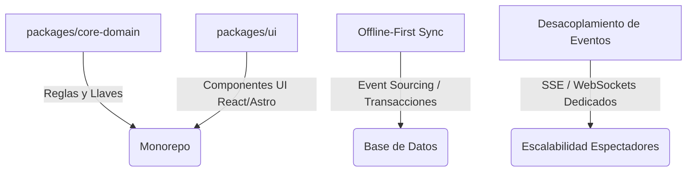
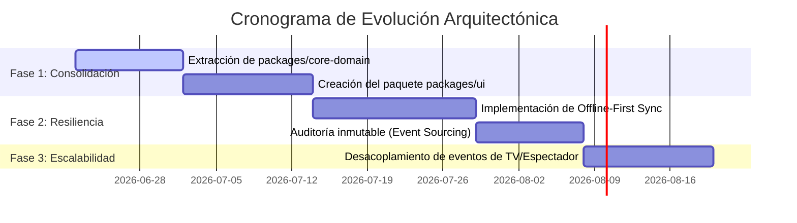

# Plan de Mejora Arquitectónica: Corner Click

Este documento detalla la visión estratégica y el plan de acción para evolucionar la arquitectura de **Corner Click**, asegurando su escalabilidad, resiliencia extrema durante competiciones en vivo y la mantenibilidad a largo plazo del monorepo.

---

## 📌 Pilares de la Propuesta

---

## 🛠️ Detalle de las Mejoras Arquitectónicas

### 1. Núcleo del Dominio Compartido (`packages/core-domain`)

* **Propósito:** Evitar la duplicación y el desfase de la lógica de negocio clave entre la API y las distintas aplicaciones front-end.
* **Acciones:**
  * Crear un nuevo paquete `packages/core-domain`.
  * Migrar algoritmos de brackets (Single/Double Elimination, Round Robin).
  * Centralizar las reglas oficiales de puntuación ITF (puntos por técnicas, penalizaciones, criterios de desempate y automatización de Golden Point).
  * Asegurar que sea 100% TypeScript puro, permitiendo que se ejecute en el servidor (Render/Node) y en el cliente offline (`web-judges` / wrapper nativo).

### 2. Sincronización Avanzada "Offline-First"

* **Propósito:** Garantizar que los torneos puedan continuar funcionando sin interrupciones incluso ante cortes prolongados de energía o conexión a Internet en el recinto.
* **Acciones:**
  * Implementar una cola local de transacciones basadas en marcas de tiempo de alta precisión.
  * Utilizar una base de datos local ligera (como IndexedDB o SQLite a nivel de cliente) administrada por service workers.
  * Implementar un mecanismo de reconciliación en la API que resuelva conflictos de forma determinista usando el historial de eventos ordenados cronológicamente al restaurar la conexión a Firestore.

### 3. Escalabilidad y Desacoplamiento de Eventos de Tiempo Real

* **Propósito:** Prevenir la degradación del servicio de puntuación (jueces) cuando hay picos masivos de tráfico por espectadores concurrentes.
* **Acciones:**
  * **Canal de Alta Prioridad (Jueces):** Mantener conexiones persistentes WebSocket exclusivas para el envío de puntajes.
  * **Canal de Consulta (Espectadores y Pantallas):** Utilizar Server-Sent Events (SSE) con almacenamiento en caché perimetral (Edge Caching) o intermediar la entrega a través de una CDN con soporte de pub/sub, reduciendo la carga directa sobre el servidor API de Render.

### 4. Sistema de Componentes Unificado (`packages/ui`)

* **Propósito:** Mantener la consistencia estética y agilizar el desarrollo de nuevas interfaces.
* **Acciones:**
  * Migrar componentes interactivos reutilizables (Scoreboard, Bracket Renderers, UI de alertas, temporizadores con Safe Zones) de las apps individuales al paquete compartido.
  * Centralizar la configuración de estilos, animaciones CSS de alto rendimiento y assets multimedia (efectos de audio, gongs).

### 5. Auditoría de Datos mediante Event Sourcing

* **Propósito:** Asegurar la transparencia del arbitraje y facilitar la auditoría de coincidencias de consenso.
* **Acciones:**
  * Almacenar los registros de votación como un flujo inmutable de micro-eventos (cada click individual) en lugar de actualizar únicamente un estado final global del match.
  * Implementar firmas criptográficas rápidas en los dispositivos de los jueces (PIN + huella del dispositivo) para certificar el origen de cada punto registrado.

---

## 📈 Plan de Ejecución Sugerido

