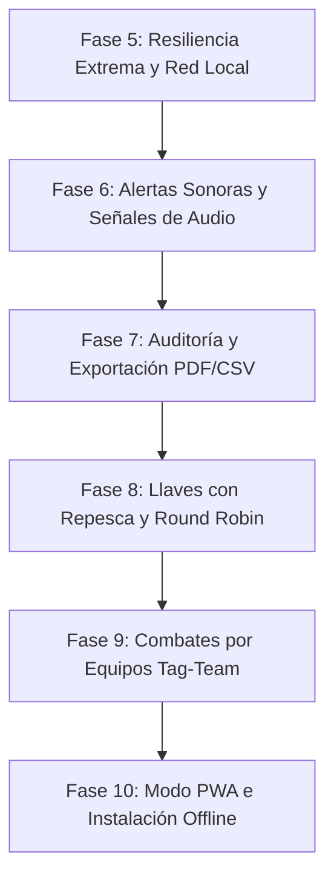

# Plan de Ruta: Fases 5 a 10 (Evolución de Corner Click)

Este documento define la planificación incremental desde la Fase 5 hasta la Fase 10 para segmentar las pruebas y entregas en pequeñas versiones estables y modulares.

---

## 📋 Resumen de Fases y Versiones

---

## 🛠️ Detalle de Cada Fase

### Fase 5 — Resiliencia Extrema y Red Local (Local Network Fallback)
* **Objetivo:** Permitir que el torneo funcione al 100% de capacidad en una red local privada (LAN) si el Wi-Fi del estadio pierde acceso a internet.
* **Componentes:**
  * Implementar WebSockets (mediante `socket.io` o WebSocket nativo) en el servidor de la API (`apps/api`).
  * En las aplicaciones (`web-judges` y `web-admin`), agregar un detector de pérdida de conexión de Firebase que cambie automáticamente al fallback de WebSocket local apuntando a la IP local del servidor de la API.
  * Sincronización diferida: el servidor local almacena los cambios en memoria/SQLite local y los sincroniza a la nube (Firestore/RTDB) tan pronto retorne la conexión a internet.

### Fase 6 — Alertas Sonoras y Señales de Audio (Acoustic Feedback)
* **Objetivo:** Informar acústicamente el inicio y cese de acciones a competidores, jueces y al público.
* **Componentes:**
  * Integrar síntesis/reproducción de audio HTML5 (`AudioContext` o archivos `.wav` de alto impacto) en el proyector de TV (`web-admin/tv`).
  * Señal de Gong/Chicharra al llegar a `00:00` en el temporizador de combate.
  * Señales acústicas distintivas en la mesa del Jury al cambiar estados (Start, Pause, Golden Point).
  * Alertas sonoras cortas en los pads de los jueces para confirmar el registro exitoso del voto (opcional).

### Fase 7 — Estadísticas, Auditoría y Exportación (Analytics & Export)
* **Objetivo:** Ofrecer reportes analíticos e históricos descargables oficiales para la federación organizadora.
* **Componentes:**
  * **Exportación Oficial:** Generar las llaves de brackets y la tabla final de posiciones en formatos PDF y hojas de cálculo CSV directamente desde el administrador.
  * **Auditoría de Arbitraje:** Panel para evaluar el rendimiento de los jueces (consistencia de clicks, tiempos promedio de respuesta, tendencias de puntuación).
  * **Mapas de Calor de Técnicas:** Gráficos que indiquen qué técnicas (Mano +1, Patada M +2, Patada A +3) son más frecuentes por categoría.

### Fase 8 — Llaves con Repesca y Round Robin (Alternative Brackets)
* **Objetivo:** Soportar formatos avanzados de torneos más allá de la eliminación directa simple.
* **Componentes:**
  * **Doble Eliminación (Repechage / Repesca):** Modificar el algoritmo de sorteos y la interfaz gráfica de visualización del bracket para gestionar la llave de perdedores.
  * **Round Robin (Todos contra todos):** Lógica para pools o grupos pequeños (3 o 4 competidores) donde clasifican los dos mejores por puntaje acumulado.
  * Adaptar el avance de llaves del Jury para respetar el flujo de repesca.

### Fase 9 — Modalidad de Combate por Equipos (Team Sparring)
* **Objetivo:** Soportar la modalidad oficial de combate por equipos ITF.
* **Componentes:**
  * Lógica de combate para 5 competidores por equipo (donde se acumulan los scores totales de cada luchador individual o bajo modalidad tag-team dinámica).
  * Panel de Jury adaptado para cambiar el competidor activo en el tapiz de forma rápida.
  * Tablero de TV con los dos logotipos del club/país del equipo y las fotos o nombres del competidor activo actual vs oponente.

### Fase 10 — PWA, Caché e Instalación Offline (Production Readiness)
* **Objetivo:** Facilitar la instalación y arranque inmediato de la app de jueces sin depender de descargas o actualizaciones de red.
* **Componentes:**
  * Configurar `web-judges` como una **Progressive Web App (PWA)** instalable en la pantalla de inicio del teléfono del árbitro.
  * **Service Workers:** Guardar en caché local el 100% de la interfaz gráfica y assets de la web, permitiendo abrir la aplicación e iniciar el modo offline (`PIN 9999`) incluso si el teléfono no tiene configurado ningún tipo de red.
  * Auditoría final de seguridad y optimización de rendimiento móvil.
